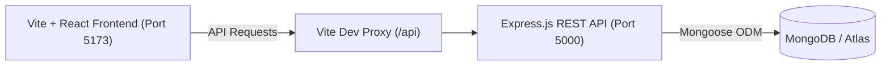

# 🌐 WebManager

**WebManager** is a full-stack developer platform designed to organize, visualize, and track software projects, microservice components, multi-environment deployments, and cloud infrastructure providers in a unified dashboard.

---

## 🌟 Key Features

- **Project Management**: Organize applications, repositories, tech stacks, tags, and custom metadata.
- **Component Architecture**: Breakdown complex systems into modular tiers (`frontend`, `backend`, `database`, `worker`, `mobile`, `other`) with repository branches and internal ports.
- **Deployment Tracking**: Map live deployment instances (`production`, `staging`, `development`, `preview`) across cloud providers with active URLs and notes.
- **Provider Registry**: Manage global cloud hosts, deployment platforms, and infrastructure services.
- **System Insights**: Visual breakdowns of tech stacks, active components, and deployment distribution across projects.
- **User Authentication**: Secure JWT-based authentication, user profiles, and encrypted password management.
- **Modern Responsive UI**: Fast React 19 interface powered by Vite with Light/Dark mode switching and live search.

---

## 🏗 Architecture



- **Frontend**: React 19, Vite 8, pure CSS design system with custom variables.
- **Backend**: Express 4, Node.js HTTP server, JWT authentication, `bcrypt`.
- **Database**: MongoDB (Local or MongoDB Atlas cluster via Mongoose 9).

---

## 📁 Repository Structure

```
Manager/
├── .gitignore               # Root ignore rules for node_modules, .env, build output
├── client/                  # Frontend single-page application
│   ├── public/              # Static icons and assets
│   ├── src/
│   │   ├── App.jsx          # Main application logic, state, tabs, and modals
│   │   ├── App.css          # Application design system & themes
│   │   ├── index.css        # Global CSS resets
│   │   └── main.jsx         # React root mounting
│   ├── vite.config.js       # Vite configuration & dev server proxy (/api -> 5000)
│   ├── package.json
│   └── README.md
└── server/                  # Backend REST API service
    ├── bin/www              # Server entrypoint and MongoDB connection initialization
    ├── app.js               # Express middleware and routing
    ├── middleware/          # JWT auth middleware
    ├── models/              # Mongoose schemas (User, Project, Provider)
    ├── routes/              # Express API route handlers
    ├── seed.js              # Database seed script
    ├── wipe.js              # Database reset script
    ├── .env.example         # Environment template
    ├── package.json
    └── README.md            # Detailed backend API documentation
```

---

## 🚀 Quickstart Guide

### 1. Prerequisites
- **Node.js**: `v18.x` or higher
- **npm**: `v9.x` or higher
- **MongoDB**: A running local instance (`mongodb://127.0.0.1:27017`) or a free [MongoDB Atlas](https://www.mongodb.com/cloud/atlas) cluster connection string.

---

### 2. Backend Setup

1. Open a terminal and navigate to the `server` folder:
   ```bash
   cd server
   ```

2. Install dependencies:
   ```bash
   npm install
   ```

3. Create your `.env` configuration file from the template:
   ```bash
   cp .env.example .env
   ```

4. Configure your `.env` file:
   ```env
   PORT=5000
   MONGODB_URI=mongodb+srv://<username>:<password>@cluster0.xxx.mongodb.net/project-manager
   JWT_SECRET=your_custom_jwt_secret_key_here
   ```

5. *(Optional)* Seed the database with an initial administrator account:
   ```bash
   node seed.js
   ```
   *Default seed credentials*:
   - **Email**: `admin@admin.com`
   - **Password**: `admin`

6. Start the backend server:
   ```bash
   npm start
   ```
   The backend will be available at `http://localhost:5000`.

---

### 3. Frontend Setup

1. Open a second terminal and navigate to the `client` directory:
   ```bash
   cd client
   ```

2. Install dependencies:
   ```bash
   npm install
   ```

3. Start the Vite development server:
   ```bash
   npm run dev
   ```

4. Open your browser at **[http://localhost:5173](http://localhost:5173)**.

---

## 🛡️ Security & Environment Best Practices

> [!IMPORTANT]
> **Keep your secrets safe**:
> - Never commit `.env` files to git. All `.env` files are ignored by default via the root `.gitignore`.
> - Always update passwords and API keys before deploying to production.
> - If database credentials or secret keys are ever exposed or committed to a public repository, immediately rotate the credentials in MongoDB Atlas and untrack the file using `git rm --cached <path/to/.env>`.

---

## 📜 Available Scripts

### Server (`server/`)
- `npm start`: Runs the production HTTP server on the configured port.
- `node seed.js`: Creates the initial admin user in MongoDB.
- `node wipe.js`: Clears all data from the connected database.

### Client (`client/`)
- `npm run dev`: Starts the local Vite development server with Hot Module Replacement (HMR).
- `npm run build`: Compiles production-ready static assets to `client/dist`.
- `npm run preview`: Locally previews the production build.
- `npm run lint`: Runs ESLint to check for code quality and syntax issues.
